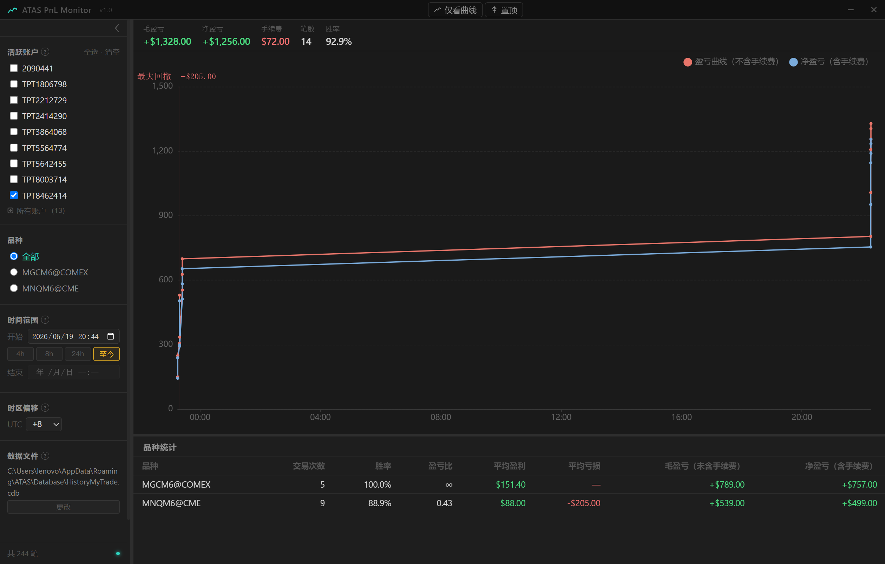
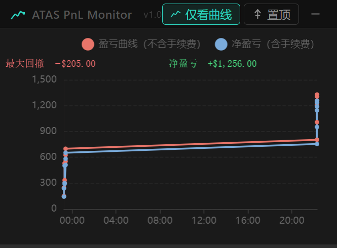

[English](README.md) | [简体中文](README.zh-CN.md)

# ATAS PnL Monitor

**ATAS 8.x 实时盈亏曲线工具 —— 补回 v8 移除的曲线功能。**

ATAS 8.0 移除了 7.x 时代交易者所依赖的内置盈亏曲线。本工具直接读取 ATAS 的成交记录文件，实时绘制累计盈亏曲线，悬浮置顶在屏幕角落，让你在交易时始终看到当前盈亏走势。

---





<!-- 请将下方注释替换为实际截图 -->
<!--  -->

---

## 功能特性

- **实时更新** — 监听文件变化，有新成交立即刷新，无需手动操作
- **双曲线对比** — 同时显示毛盈亏（不含手续费）与净盈亏（含手续费）
- **净盈亏数值叠加** — 仅看曲线模式下始终显示当前净盈亏值，即便多笔单子集中平仓、曲线压成竖线也能一目了然
- **最大回撤标注** — 自动计算并高亮最大回撤区间，标注回撤金额
- **多账户筛选** — 侧边栏快速勾选活跃账户；弹窗查看全量历史账户，支持按交易时段查看
- **品种筛选** — 查看全部品种合并曲线，或单独查看某一品种
- **时间范围** — 4h / 8h / 24h 快捷跨度，或自定义起止时间；「至今」模式实时追踪
- **仅看曲线模式** — 隐藏所有面板，曲线撑满窗口
- **置顶** — 独立于曲线模式，可单独开启，始终悬浮在交易软件上方
- **双模式窗口记忆** — 完整模式与曲线模式各自独立保存窗口位置和尺寸；换接显示器时自动回正，不会跑到屏幕外
- **时区偏移** — 将 X 轴时间调整为任意 UTC 偏移，方便复盘本地时间
- **深色无边框界面** — 简洁，不干扰交易注意力

---

## 下载

前往 [**Releases**](../../releases) 下载最新版本：

| 文件 | 说明 |
|------|------|
| `ATAS-PnL-Monitor-portable.exe` | 便携版 — 无需安装，直接运行 |
| `ATAS PnL Monitor Setup 1.1.1.exe` | NSIS 安装包，自动创建桌面快捷方式 |

程序已打包为独立 EXE，无需安装 Node.js 等任何运行环境。

---

## 使用手册

详细使用说明请查看：[**docs/user-guide.zh-CN.md**](docs/user-guide.zh-CN.md)

---

## 数据文件

程序默认读取 ATAS 的成交记录文件，路径为：

```
%APPDATA%\ATAS\Database\HistoryMyTrade.cdb
```

完整路径示例：

```
C:\Users\你的用户名\AppData\Roaming\ATAS\Database\HistoryMyTrade.cdb
```

若文件不在默认路径，可在侧边栏「数据文件」区块点击**更改**手动选择。

> 需要在同一台电脑上安装 ATAS 8.0 或更高版本。

---

## 从源码编译

**环境要求：** Windows 10/11 x64 · Node.js 18+

```bash
git clone https://github.com/Misc0101/atas-pnl-monitor.git
cd atas-pnl-monitor/src

npm install        # 安装依赖（首次克隆后执行一次）
npm start          # 开发模式启动
npm run build      # 打包 → src/dist/
```

打包产物位于 `src/dist/`：

| 文件 | 说明 |
|------|------|
| `ATAS-PnL-Monitor-portable.exe` | 单文件便携版 |
| `ATAS PnL Monitor Setup 1.1.1.exe` | NSIS 安装包 |

> `src/build/icon.ico` 已预先生成并随源码一起提交，无需重新生成。仅在修改了 `src/build/icon.svg` 后才需执行 `npm run icon`。

---

## 技术栈

| 层级 | 技术 |
|------|------|
| 桌面框架 | [Electron 29](https://www.electronjs.org/) |
| 图表库 | [ECharts 5](https://echarts.apache.org/) |
| 前端 | 原生 HTML / CSS / JavaScript |
| 打包 | [electron-builder 24](https://www.electron.build/) |

---

## License

[MIT](LICENSE)
